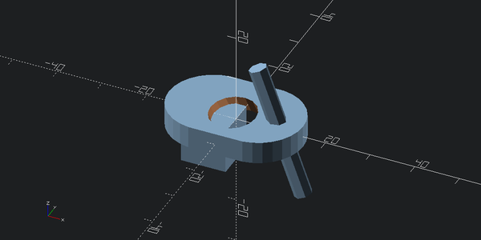
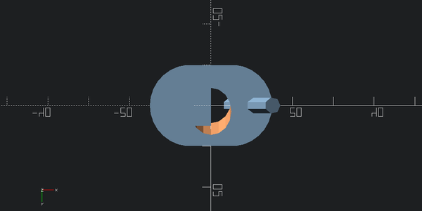
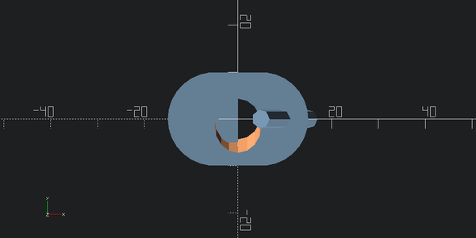
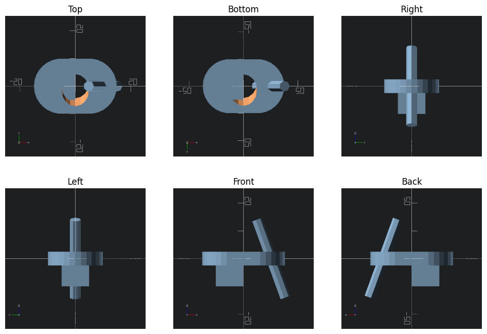
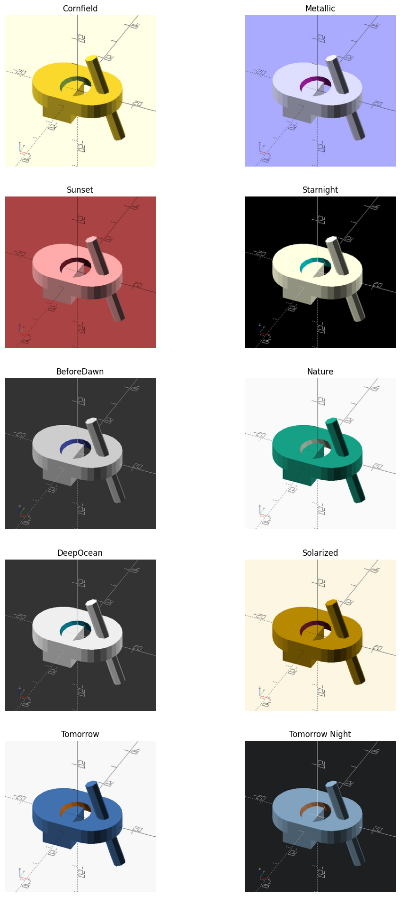
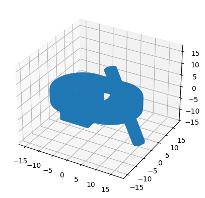

# scad


<!-- WARNING: THIS FILE WAS AUTOGENERATED! DO NOT EDIT! -->

–camera arg camera parameters when exporting png:
=translate_x,y,z,rot_x,y,z,dist or =eye_x,y,z,center_x,y,z

``` python
a = (10,20,30)
','.join(map(str,a))
```

    '10,20,30'

``` python
a = []
if a:
    print("yes")
```

------------------------------------------------------------------------

### export_to

>  export_to (model, export_format, w=600, h=300, colorscheme=None,
>                 translate=None, rot=None, dist=None, eye=None, center=None,
>                 viewall=True)

------------------------------------------------------------------------

### view

>  view (model, w=600, h=300, colorscheme=None, translate=None, rot=None,
>            dist=None, eye=None, center=None, viewall=True)

*Convert model to image*

Lets add simple and fast automatic previews for all models:

We also delete `__repr__` so that text representations of models are not
saved as part of notebooks. These representations can get quite lengthy
especially if we programatically generate models with python as opposed
to using OpenSCAD model and import functions.

``` python
d = ((cylinder(5,r=10,center=True).right(5) + cylinder(5,r=10,center=True).left(5)).hull()
     - cylinder(40,r=5, center=True).rotate([30,0,0])
     + cylinder(30,r=2,center=True).rotate([0,-20,0]).translate([10,0,0])
     + cube([10,10,10],center=True).translate([-5,0,-5]))
d
```



Viewing from different directions:

------------------------------------------------------------------------

### view_back

>  view_back (d, w=600, h=300, colorscheme=None, translate=None, rot=None,
>                 dist=None, eye=None, center=None, viewall=True)

------------------------------------------------------------------------

### view_front

>  view_front (d, w=600, h=300, colorscheme=None, translate=None, rot=None,
>                  dist=None, eye=None, center=None, viewall=True)

------------------------------------------------------------------------

### view_left

>  view_left (d, w=600, h=300, colorscheme=None, translate=None, rot=None,
>                 dist=None, eye=None, center=None, viewall=True)

------------------------------------------------------------------------

### view_right

>  view_right (d, w=600, h=300, colorscheme=None, translate=None, rot=None,
>                  dist=None, eye=None, center=None, viewall=True)

------------------------------------------------------------------------

### view_bottom

>  view_bottom (d, w=600, h=300, colorscheme=None, translate=None, rot=None,
>                   dist=None, eye=None, center=None, viewall=True)

------------------------------------------------------------------------

### view_top

>  view_top (d, w=600, h=300, colorscheme=None, translate=None, rot=None,
>                dist=None, eye=None, center=None, viewall=True)

``` python
view_bottom(d)
```



``` python
view_top(d)
```



``` python
12/3*2
```

    8.0

------------------------------------------------------------------------

### view_all

>  view_all (d)

``` python
d
```


``` python
view_all(d)
```



## Colorschemes

You can configure the colorscheme you like by setting `scad.colorscheme`
to appropritate string:

``` python
fig, axs = plt.subplots(5,2, figsize=(12,24)) # 2,5
axs = axs.flatten()

for ax, cs in zip(axs, colorschemes):
    ax.imshow(view(d, 300, 300, cs))
    ax.axis("off")
    ax.set_title(cs)
```



## Exporting to STL

------------------------------------------------------------------------

### export_to_stl

>  export_to_stl (model)

``` python
stl = export_to_stl(d)
```

``` python
volume, cog, inertia = stl.get_mass_properties()
print("Volume                                  = {0}".format(volume))
print("Position of the center of gravity (COG) = {0}".format(cog))
print("Inertia matrix at expressed at the COG  = {0}".format(inertia[0,:]))
print("                                          {0}".format(inertia[1,:]))
print("                                          {0}".format(inertia[2,:]))
print("Your mesh is closed: {0}".format(stl.is_closed(exact=True)))
```

    Volume                                  = 3233.8717447916665
    Position of the center of gravity (COG) = [-0.39244195  0.01129184 -1.48824022]
    Inertia matrix at expressed at the COG  = [ 1.26691235e+05  9.59202307e+01 -1.40417640e+04]
                                              [ 9.59202307e+01  2.56363254e+05 -5.24176883e+02]
                                              [-14041.76401878   -524.17688261 279222.64519674]
    Your mesh is closed: True

``` python
figure = pyplot.figure()
axes = figure.add_subplot(projection='3d')

axes.add_collection3d(mplot3d.art3d.Poly3DCollection(stl.vectors))

scale = stl.points.flatten()
axes.auto_scale_xyz(scale, scale, scale)

pyplot.show()
```


