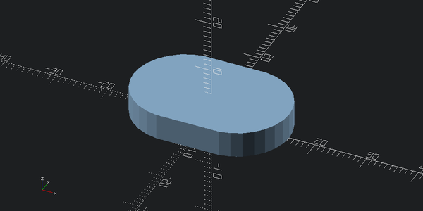
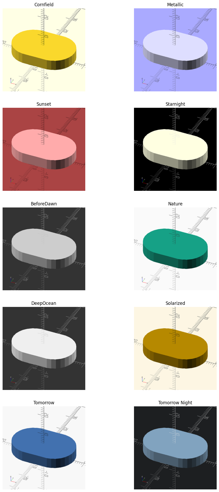
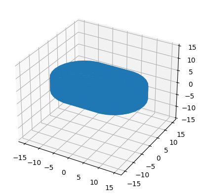

# scad


<!-- WARNING: THIS FILE WAS AUTOGENERATED! DO NOT EDIT! -->

------------------------------------------------------------------------

<a href="https://github.com/ozpau/cadlab/blob/main/cadlab/scad.py#L33"
target="_blank" style="float:right; font-size:smaller">source</a>

### export_to

>  export_to (model, export_format, w=600, h=300, colorscheme=None)

------------------------------------------------------------------------

<a href="https://github.com/ozpau/cadlab/blob/main/cadlab/scad.py#L51"
target="_blank" style="float:right; font-size:smaller">source</a>

### to_img

>  to_img (model, w=600, h=300, colorscheme=None)

*Convert model to image*

Lets add simple and fast automatic previews for all models:

``` python
d = (cylinder(5,r=10).right(5) + cylinder(5,r=10).left(5)).hull()
d
```



## Colorschemes

You can configure the colorscheme you like by setting `scad.colorscheme`
to appropritate string:

``` python
fig, axs = plt.subplots(5,2, figsize=(12,24)) # 2,5
axs = axs.flatten()

for ax, cs in zip(axs, colorschemes):
    ax.imshow(to_img(d, 300, 300, cs))
    ax.axis("off")
    ax.set_title(cs)
```



## Exporting to STL

------------------------------------------------------------------------

<a href="https://github.com/ozpau/cadlab/blob/main/cadlab/scad.py#L68"
target="_blank" style="float:right; font-size:smaller">source</a>

### export_to_stl

>  export_to_stl (model)

``` python
stl = export_to_stl(d)
```

``` python
volume, cog, inertia = stl.get_mass_properties()
print("Volume                                  = {0}".format(volume))
print("Position of the center of gravity (COG) = {0}".format(cog))
print("Inertia matrix at expressed at the COG  = {0}".format(inertia[0,:]))
print("                                          {0}".format(inertia[1,:]))
print("                                          {0}".format(inertia[2,:]))
print("Your mesh is closed: {0}".format(stl.is_closed(exact=True)))
```

    Volume                                  = 2553.8624674479165
    Position of the center of gravity (COG) = [-1.59327703e-07  2.98739444e-09  2.50000080e+00]
    Inertia matrix at expressed at the COG  = [7.68085765e+04 9.11458332e-04 1.54622072e-04]
                                              [9.11458332e-04 1.57231110e+05 3.60870367e-04]
                                              [1.54622072e-04 3.60870367e-04 2.23398600e+05]
    Your mesh is closed: True

``` python
figure = pyplot.figure()
axes = figure.add_subplot(projection='3d')

axes.add_collection3d(mplot3d.art3d.Poly3DCollection(stl.vectors))

scale = stl.points.flatten()
axes.auto_scale_xyz(scale, scale, scale)

pyplot.show()
```


