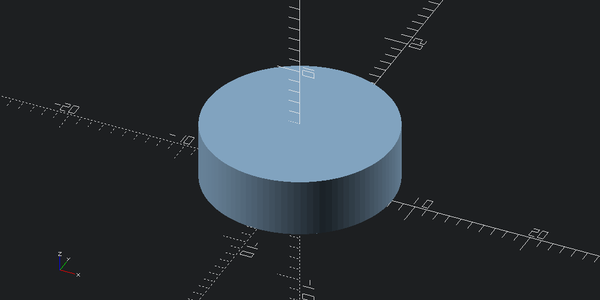
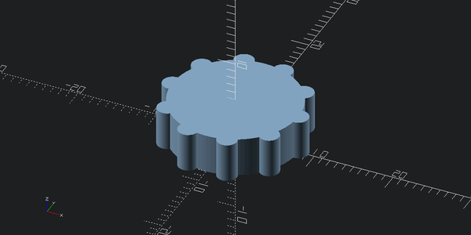
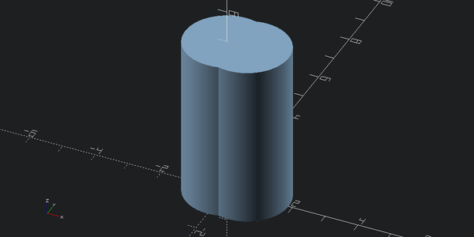
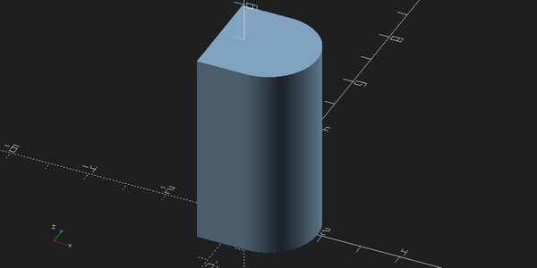
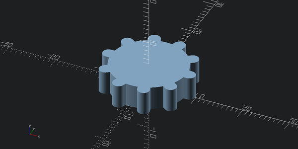
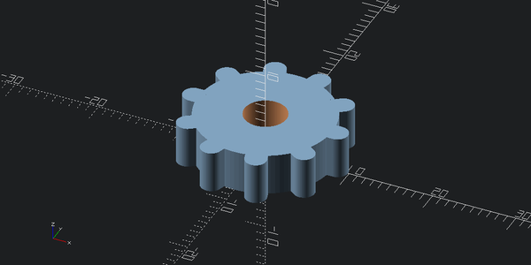

# Gear


<!-- WARNING: THIS FILE WAS AUTOGENERATED! DO NOT EDIT! -->

``` python
from cadlab.scad import *
from solid2 import *
from math import pi, cos, sin
```

``` python
set_global_fn(100)
```

A gear is a mechanical device that can be used to transmit rotational
motion. It has a flat disk shape, with teeth on the edges and a hole in
the center.

The hole is there to place the gear on an axle on which it can freely
rotate and the teeth are there to transmit rotational motion to other
gears or other mechanical components that also have teeth that are
spaced the same way.

Note that the center does not need to be circular. For example, if you
wish to attach a leaver, you can use a square hole in order to transmit
angular momentum from the leaver to the gear.

Other things are possible too. For example, you might be able to connect
the gear directly to a spiraling spring in order to act as an energy
storage device.

We start by creating the base.

``` python
gear_height = 5
radius_to_teeth = 8

base_shape = cylinder(h = gear_height, r = radius_to_teeth)
base_shape
```



Next, we need teeth. Teeth would be placed repeatedly, with spaces
between them equal to the teeth width. So, once we are set to the number
of teeth we want, we can compute teeth width from
teeth_width ⋅ 2 ⋅ n_teeth = 2 ⋅ *π* ⋅ radius_to_teeth

``` python
n_teeth = 10

teeth_width = pi * radius_to_teeth / n_teeth
teeth_width
```

    2.5132741228718345

``` python
with_teeth = base_shape
for i in range(n_teeth):
    with_teeth += cylinder(h = gear_height, r = teeth_width/2).translate([radius_to_teeth,0,0]).rotate([0,0,360/n_teeth*i])
with_teeth
```



We have teeth! But they look a bit too short. To create a longer tooth,
lets take a hull of two cylinders.

``` python
teeth_offset = 0.25 * teeth_width

tooth_end = cylinder(h = gear_height, r = teeth_width/2)
tooth = tooth_end + tooth_end.translate([teeth_offset,0,0])
tooth
```



``` python
tooth = tooth.hull()
tooth
```


We can even simplify this further since we don’t need inner side to be
circular:

``` python
tooth_end = cylinder(h = gear_height, r = teeth_width/2)
tooth = (cube([teeth_width/2, teeth_width, gear_height], center=True).translate([0,0,gear_height/2])
         + cylinder(h = gear_height, r = teeth_width/2).translate([teeth_offset,0,0]))
tooth
```



Now this geometry is simpler, so it will be faster to work with. Note
that we don’t even need hull anymore.

Lets try putting this tooth into the gear:

``` python
with_teeth = base_shape
for i in range(n_teeth):
    with_teeth += tooth.translate([radius_to_teeth,0,0]).rotate([0,0,360/n_teeth*i])
with_teeth
```



Lets cut out a hole for an axle:

``` python
axle_radius = 2.5

axle_hole = cylinder(h=gear_height*4, r=axle_radius, center=True)
gear = with_teeth - axle_hole
gear
```


