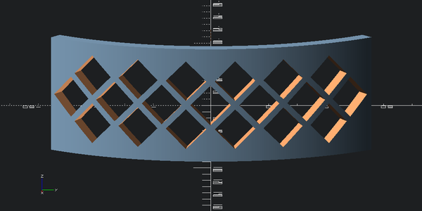

# Stick Barrette


<!-- WARNING: THIS FILE WAS AUTOGENERATED! DO NOT EDIT! -->

<table>
<colgroup>
<col style="width: 50%" />
<col style="width: 50%" />
</colgroup>
<thead>
<tr>
<th>Main (top/outer) part</th>
<th>Stick (bottom/inner) part</th>
</tr>
</thead>
<tbody>
<tr>
<td><a title="Auckland Museum, CC BY 4.0 &lt;https://creativecommons.org/licenses/by/4.0&gt;, via Wikimedia Commons" href="https://commons.wikimedia.org/wiki/File:Hair_slide_(AM_1993.1-3).jpg"></a></td>
<td><a title="Auckland Museum, CC BY 4.0 &lt;https://creativecommons.org/licenses/by/4.0&gt;, via Wikimedia Commons" href="https://commons.wikimedia.org/wiki/File:Hair_slide_(AM_1993.1-4).jpg"></a></td>
</tr>
</tbody>
</table>

Lets design this part. As opposed to other hair clips, there is no need
for complex spring mechanism, and the whole thing can be 3d printed
without any supports.

``` python
set_global_fn(100)
```

Length of the outer part.

``` python
outer_length = 120
```

Now we need the radius of circumference.
[This](https://en.wikipedia.org/wiki/Occipital_bone) is the part of the
human skull we are interested in. The radius of circumference varies
from person to person, but is about 9 cm according to Llama 3.3 70B, and
that sounds about right, so I am gonna trust it for now.

``` python
outer_radius = 90
```

Note that we could make an arc by subtracting a section from a circle,
but this won’t work for angles larger than 180 degrees. So let’s just
use a polygon.

------------------------------------------------------------------------

<a
href="https://github.com/ozpau/cadlab/blob/main/cadlab/scad/helpers/arc.py#L18"
target="_blank" style="float:right; font-size:smaller">source</a>

### arc_2d

>  arc_2d (r, start_angle, end_angle, thickness, step=0.5)

``` python
r = 50
thickness = 5

start_angle = 0
end_angle = 90
arc_2d(r, start_angle, end_angle, thickness)
```


``` python
arc_2d(r, -45, 45, thickness)
```


``` python
arc_2d(r, -45, 45, thickness)
```


``` python
@delegates(arc_2d)
def arc_3d(r, start_angle, end_angle, thickness, height, **kwargs):
    return (arc_2d(r, start_angle, end_angle, thickness, **kwargs)).linear_extrude(height)
```

``` python
arc_3d(r, -45, 45, thickness, 50)
```


``` python
outer_height = 40
```

``` python
outer_angle = outer_length / outer_radius
outer_angle = np.rad2deg(outer_angle)
outer_angle
```

    np.float64(76.39437268410975)

``` python
outer_thickness = 5
```

``` python
outer_part = arc_3d(outer_radius, -outer_angle/2, outer_angle/2, outer_thickness, outer_height)
outer_part
```


Cool, now lets add holes where inner part would go. To make it
compatible with 3d printing, lets make holes using a 45 degree rotated
cube so that we only have 45 degree inclines maximum.

``` python
r = outer_radius*1.2
hole_size = 10

hole_cutter = (cube([r,hole_size,hole_size])
               .translate([0,-hole_size/2,-hole_size/2])
               .rotate([45,0,0])
               .translate([0,0,outer_height/2]))

outer_part + hole_cutter
```


``` python
outer_part - hole_cutter
```


``` python
hole_inset_angle = 10
outer_part - hole_cutter.rotate([0,0,-(outer_angle/2-hole_inset_angle)])
```


``` python
outer_with_holes = (outer_part
                    -hole_cutter.rotate([0,0,-(outer_angle/2-hole_inset_angle)])
                    -hole_cutter.rotate([0,0,(outer_angle/2-hole_inset_angle)]))

view(outer_with_holes, eye=(outer_radius*2,0,outer_height), viewall=False)
```


These holes look cool, so let’s make a repeating pattern.

For 3d printing, using more holes would also speed up the printing time
and reduce material usage.

## Adding repeating pattern

Now we are back to the same problem we had when we needed to place teeth
in the [gear](00_gear.ipynb) example.

We have a polygonal section of known radius and of known segment length
and we want to relate that to angles.

Aside: turns out this problem has a nice application to wave
[diffraction](https://www.feynmanlectures.caltech.edu/I_30.html).

``` python
n = 4+1
r = 2
rs = r*np.ones(n)
theta = np.linspace(-np.deg2rad(45),np.deg2rad(45),n)

fig, ax = plt.subplots(subplot_kw={'projection': 'polar'}, figsize=(5,5))
ax.plot(theta, rs)
ax.set_rmax(r*1.2)
#ax.set_rticks([0.5, 1, 1.5, 2])  # Less radial ticks
#ax.set_rlabel_position(-22.5)  # Move radial labels away from plotted line
ax.grid(True)
```


Here we have a circle of radius 2 and a polyhedral segment where
distance from origin to every vertex is equal to 2 and angle between
each pair of consequent vertices is equal to 90/4 = 22.5 degrees.

In our other problem, on the other hand, we know segment length (it’s
diagonal of the cube plus any margin we need), and we know the radius
(it’s outer_radius), and we want to know how much angular spacing is
between each consequent pair of vertices.

We have an equilateral triangle of known side and base and we want to
find the height. If we split base into two, we would end up with the
right triangle.

Hence, the sine of the half angle is equal to the half base divided by
the side.

Thus:

------------------------------------------------------------------------

<a
href="https://github.com/ozpau/cadlab/blob/main/cadlab/scad/helpers/arc.py#L26"
target="_blank" style="float:right; font-size:smaller">source</a>

### segment_angle

>  segment_angle (base, side, deg=True)

``` python
test_eq(segment_angle(0,10), 0)
```

hole_diam<sup>2</sup> + hole_diam<sup>2</sup> = hole_size<sup>2</sup>

``` python
hole_diam = hole_size/np.sqrt(2)
hole_diam
```

    np.float64(7.071067811865475)

``` python
margin = 10
```

``` python
hole_side = hole_diam + margin
```

``` python
sa = segment_angle(hole_side, outer_radius)
sa
```

    np.float64(10.884137282582449)

Well, let’s test it out

``` python
outer_with_holes = (outer_part
                    -hole_cutter.rotate([0,0,-(outer_angle/2-hole_inset_angle)])
                    -hole_cutter.rotate([0,0,-(outer_angle/2-hole_inset_angle-sa)])
                    -hole_cutter.rotate([0,0,(outer_angle/2-hole_inset_angle)]))

view(outer_with_holes, eye=(outer_radius*2,0,outer_height), viewall=False)
```


Looks good.

Now, how many holes can we fit in total?

``` python
outer_angle / sa
```

    np.float64(7.018872575813733)

``` python
outer_with_holes = outer_part

for i in range(7):
    outer_with_holes -= hole_cutter.rotate([0,0,-(outer_angle/2-i*sa - sa/2)])

view(outer_with_holes, eye=(outer_radius*2,0,outer_height), viewall=False)
```


Looks nice! Let’s add more rows.

``` python
outer_with_holes = outer_part

for i in range(7):
    outer_with_holes -= hole_cutter.rotate([0,0,-(outer_angle/2-i*sa - sa/2)])

for i in range(6):
    outer_with_holes -= hole_cutter.rotate([0,0,-(outer_angle/2-i*sa - sa)]).translate([0,0,hole_side/2])

for i in range(6):
    outer_with_holes -= hole_cutter.rotate([0,0,-(outer_angle/2-i*sa - sa)]).translate([0,0,-hole_side/2])

outer_with_holes_v1 = outer_with_holes

view(outer_with_holes, eye=(outer_radius*2,0,outer_height), viewall=False)
```


``` python
outer_with_holes = outer_part

for i in range(7):
    outer_with_holes -= hole_cutter.rotate([0,0,-(outer_angle/2-i*sa - sa/2)])

for i in range(9):
    outer_with_holes -= hole_cutter.rotate([0,0,-(outer_angle/2-i*sa + sa)]).translate([0,0,hole_side/2])

for i in range(9):
    outer_with_holes -= hole_cutter.rotate([0,0,-(outer_angle/2-i*sa + sa)]).translate([0,0,-hole_side/2])

for i in range(7):
    outer_with_holes -= hole_cutter.rotate([0,0,-(outer_angle/2-i*sa - sa/2)]).translate([0,0,hole_side])

for i in range(7):
    outer_with_holes -= hole_cutter.rotate([0,0,-(outer_angle/2-i*sa - sa/2)]).translate([0,0,-hole_side])

view(outer_with_holes, eye=(outer_radius*2,0,outer_height), viewall=False)
```


I think I like the one with only three rows more:

``` python
outer_with_holes = outer_with_holes_v1

view(outer_with_holes, eye=(outer_radius*2,0,outer_height), viewall=False)
```



``` python
view(outer_with_holes, eye=(-outer_radius,0,2*outer_height),center=(outer_radius,0,0), viewall=False)
```


Ok, let’s 3d print this to check out how it look in real life.

``` python
stl = export_to_stl(outer_with_holes)
```

``` python
stl.save('barrette.stl')
```
