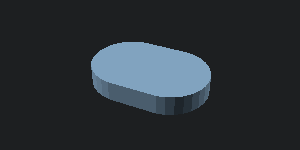
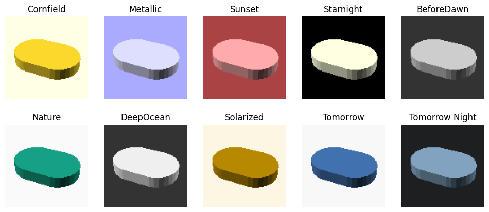

# scad


<!-- WARNING: THIS FILE WAS AUTOGENERATED! DO NOT EDIT! -->

------------------------------------------------------------------------

<a href="https://github.com/ozpau/cadlab/blob/main/cadlab/scad.py#L29"
target="_blank" style="float:right; font-size:smaller">source</a>

### export_to

>  export_to (model, export_format, w=300, h=150, colorscheme=None)

------------------------------------------------------------------------

<a href="https://github.com/ozpau/cadlab/blob/main/cadlab/scad.py#L41"
target="_blank" style="float:right; font-size:smaller">source</a>

### to_img

>  to_img (model, w=300, h=150, colorscheme=None)

*Convert model to image*

Lets add simple and fast automatic previews for all models:

``` python
@patch
def _repr_png_(self: RenderMixin):
    return to_img(self)._repr_png_()

del RenderMixin._ipython_display_
```

``` python
d = (cylinder(5,r=10).right(5) + cylinder(5,r=10).left(5)).hull()
d
```



## Colorschemes

You can configure the colorscheme you like by setting `scad.colorscheme`
to appropritate string:

``` python
fig, axs = plt.subplots(2,5, figsize=(12,5)) # 2,5
axs = axs.flatten()

for ax, cs in zip(axs, colorschemes):
    ax.imshow(to_img(d, 100, 100, cs))
    ax.axis("off")
    ax.set_title(cs)
```



## Exporting to STL

``` python
import solid2
```

``` python
d.save_as_stl??
```

    Signature: d.save_as_stl(filename=None)
    Docstring: <no docstring>
    Source:   
        def save_as_stl(self, filename=None):
            from ..scad_render import render_to_stl_file
            return render_to_stl_file(self, filename)
    File:      ~/nbdev/contrib/SolidPython/solid2/core/object_base/object_base_impl.py
    Type:      method

------------------------------------------------------------------------

<a href="https://github.com/ozpau/cadlab/blob/main/cadlab/scad.py#L49"
target="_blank" style="float:right; font-size:smaller">source</a>

### foo

>  foo ()
